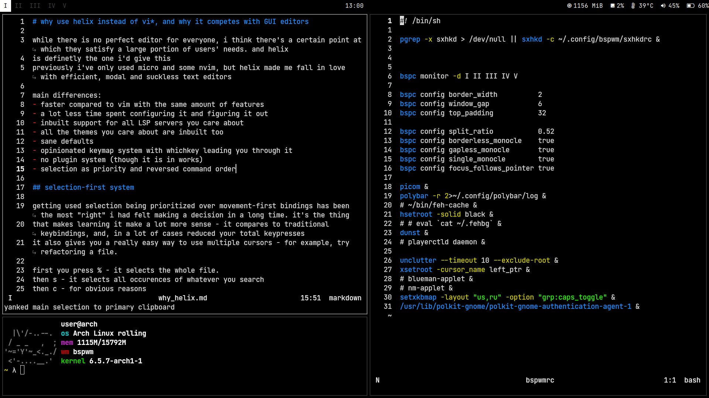

# silent bspwm



### installation

dependencies are listed in ./deps file, should be the same for every system  
arch autoinstall would be

```pacman -S $(cat ./deps) --needed && cp -r ./.config/* ~/.config/```

or on debian systems it (might be, untested yet)
```apt install $(cat ./deps)```

then either copy the .xinitrc yo your home dir or do ```startx /repo/path/.xinitrc```
### things you should know

- ```super + s``` gives u all the shortcuts in sxhkdrc that have a comment above them just like in awesomewm
- ```super + {w,e,r}``` can control media just like the regular media keys. look line 158 in ```.config/bspwm/sxhkdrc``` if you need to disable them
- ```super + b``` hides the bar, ```super + shift + b``` unhides
- sxhkdrc is inside the bspwm config path for modularity
- i run an optimus laptop so .xinitrc has first 2 lines added
- not tested at all yet, make issues or message me if something is wrong
